# MicroSpringBoot

Mini framew
ork IoC tipo Spring Boot implementado en **Java puro usando reflexión**. Incluye un servidor HTTP que sirve páginas HTML, imágenes PNG y enruta peticiones a controladores REST — sin ninguna dependencia externa.

---

## ¿Qué es esto?

Este proyecto demuestra las capacidades reflexivas de Java construyendo un mini-framework similar a Spring Boot desde cero. El framework:

1. **Escanea el classpath** buscando clases anotadas con `@RestController`
2. **Registra automáticamente** los métodos anotados con `@GetMapping`
3. **Invoca los métodos** usando reflexión cuando llega una petición HTTP
4. **Resuelve parámetros** de query string usando `@RequestParam`

---

### Flujo de una petición

```
Navegador → GET /greeting?name=Juan
    → HttpServer lee la petición
    → Busca "/greeting" en routeMap
    → Invoca GreetingController.greeting("Juan") via reflexión
    → Retorna "Hola Juan"
    → HttpServer responde HTTP 200
```
---

## Requisitos

- Java 11+
- Maven 3.6+

---

## Instalación y ejecución

### 1. Clonar el repositorio

```bash
git clone ...

```

### 2. Compilar

```bash
mvn clean package
```

### 3. Ejecutar

**Modo auto-escaneo** — el framework detecta todos los `@RestController` automáticamente:

```bash
java -cp target/classes co.edu.escuelaing.reflexionlab.MicroSpringBoot
```

**Modo manual** — pasar la clase específica como argumento:

```bash
java -cp target/classes co.edu.escuelaing.reflexionlab.MicroSpringBoot co.edu.escuelaing.reflexionlab.controllers.HelloController
```
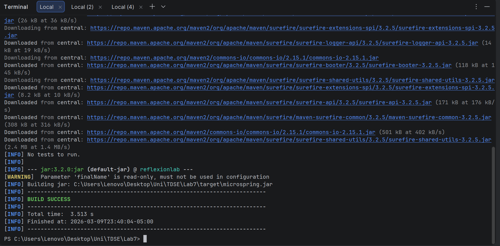
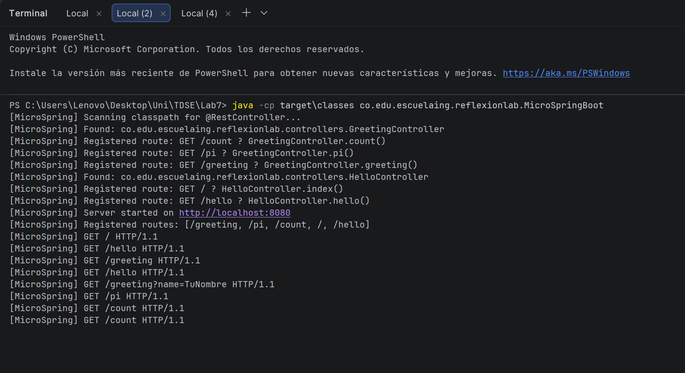
### 4. Abrir en el navegador

```
http://localhost:8080
```
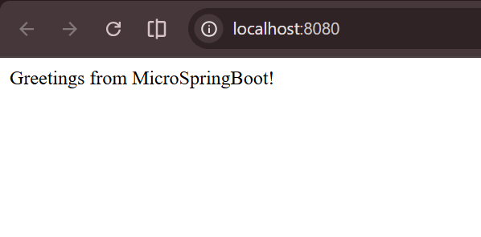
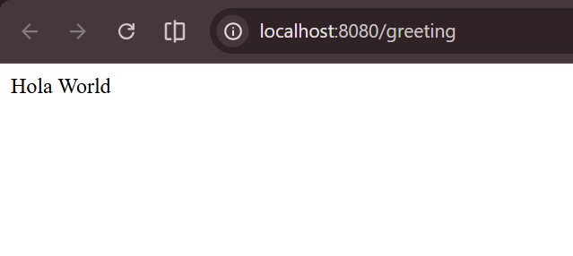
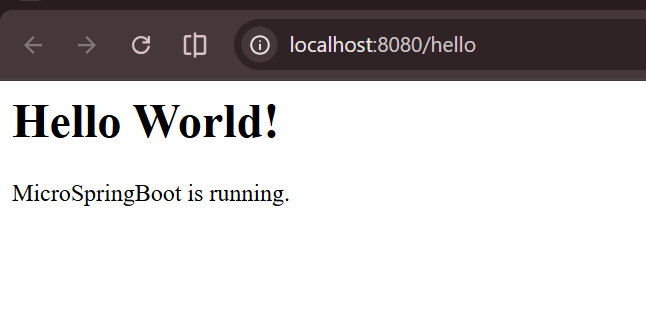
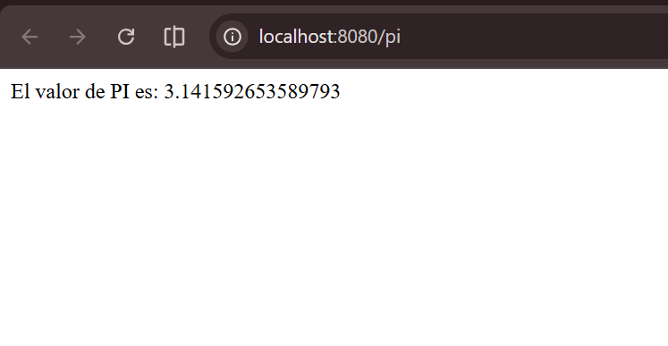
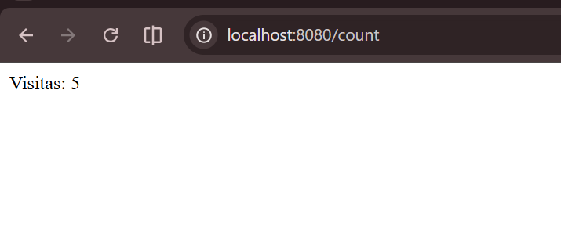
---

## Rutas disponibles

| Método | Ruta | Descripción | Ejemplo |
|--------|------|-------------|---------|
| GET | `/` | Saludo principal | http://localhost:8080/ |
| GET | `/hello` | Página Hello World | http://localhost:8080/hello |
| GET | `/greeting` | Saludo con nombre por defecto | http://localhost:8080/greeting |
| GET | `/pi` | Valor de PI | http://localhost:8080/pi |
| GET | `/count` | Contador de visitas | http://localhost:8080/count |
| GET | `/index.html` | Página estática HTML | http://localhost:8080/index.html |

---

## Cómo usar el framework

### Definir un controlador

```java
@RestController
public class GreetingController {

    @GetMapping("/greeting")
    public String greeting(@RequestParam(value = "name", defaultValue = "World") String name) {
        return "Hola " + name;
    }
}
```


## Tests

El proyecto incluye 5 tests unitarios con JUnit 4 que verifican el comportamiento del framework usando reflexión.

### Ejecutar los tests

```bash
mvn test
```
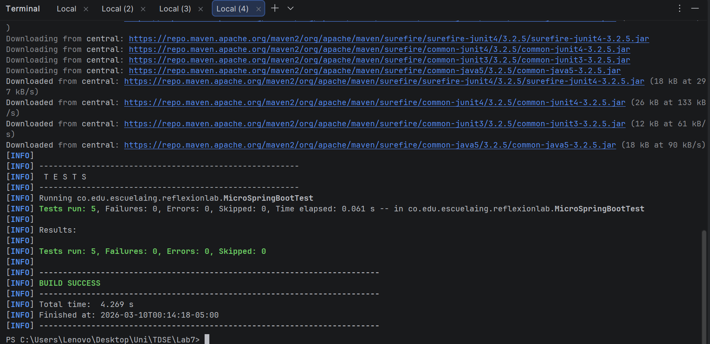
---

## Despliegue en AWS EC2

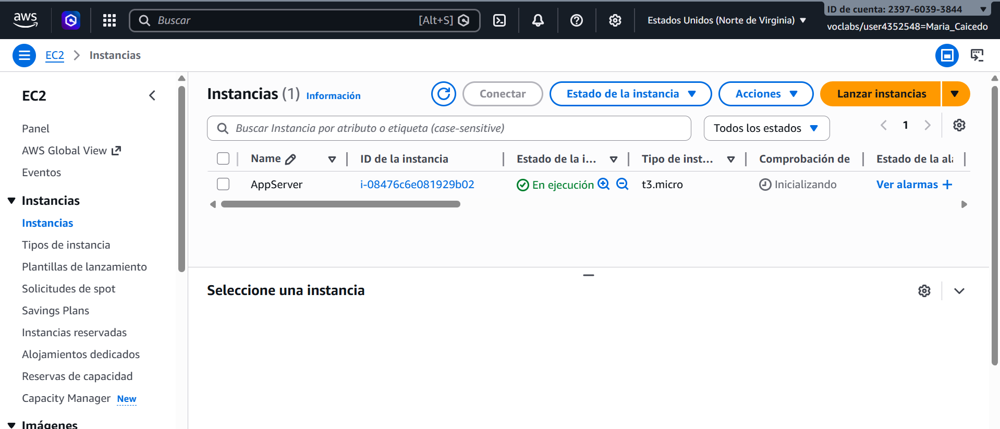
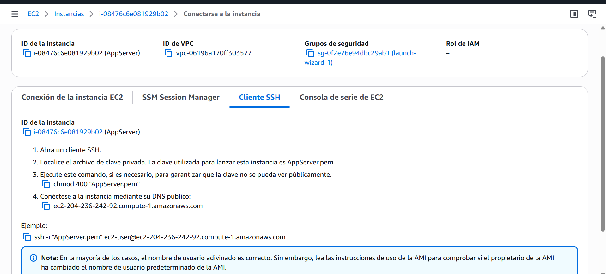
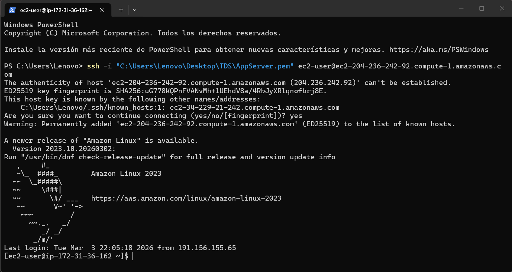
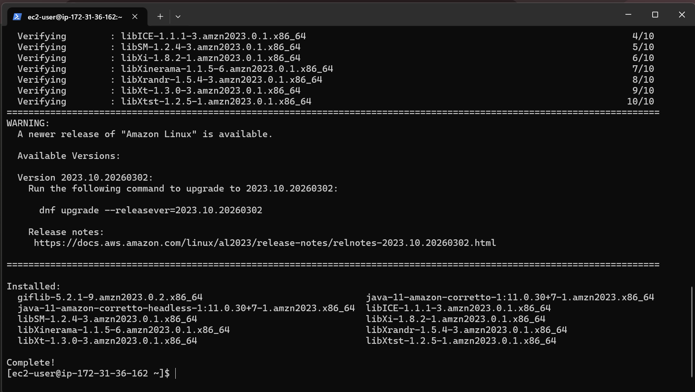
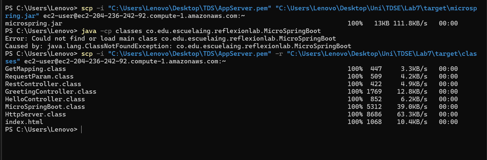
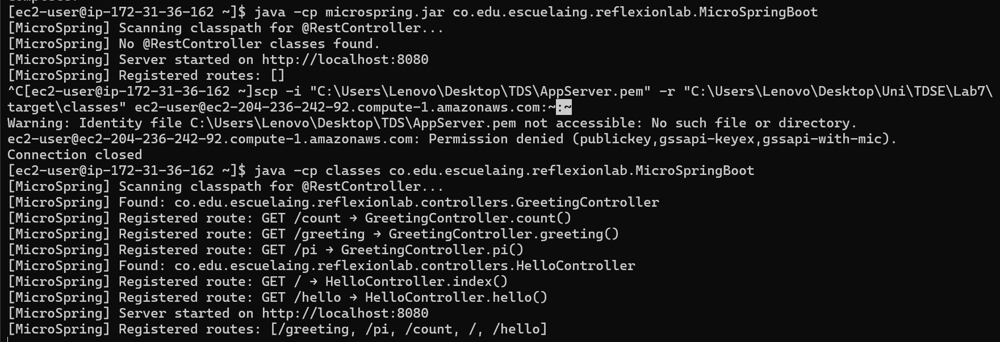
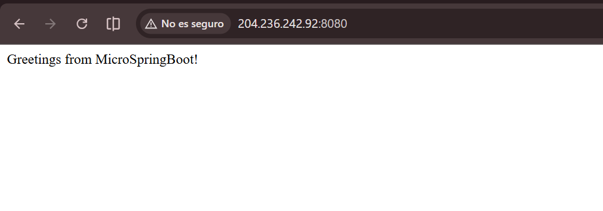